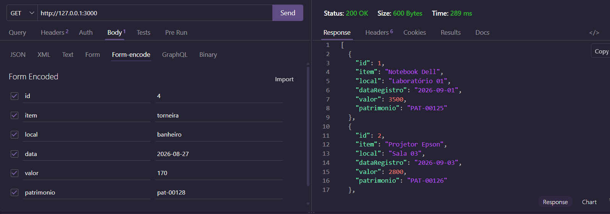
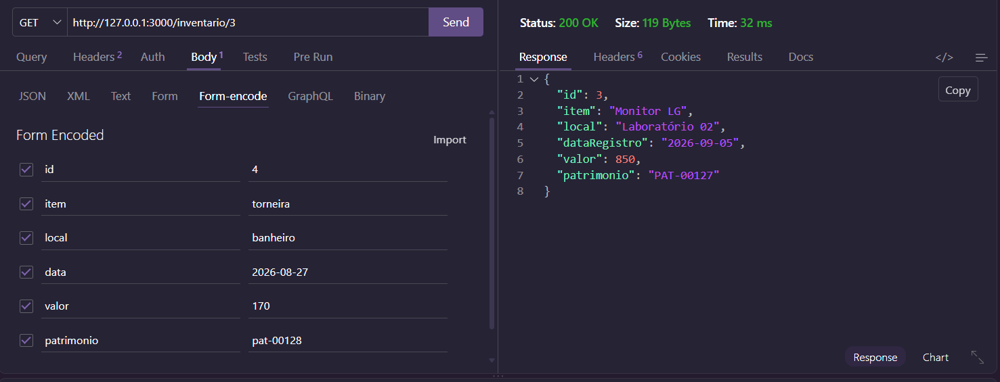
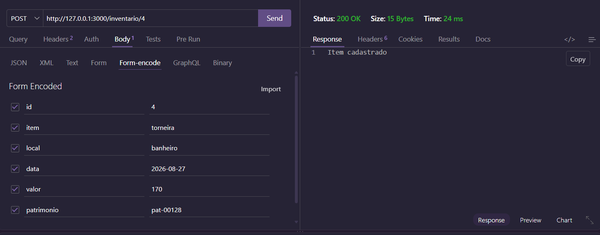
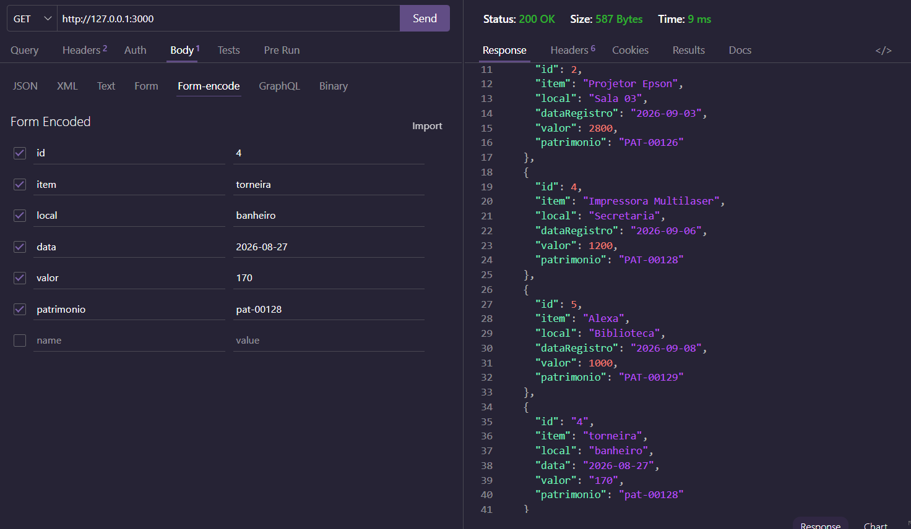
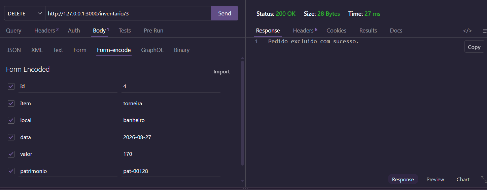
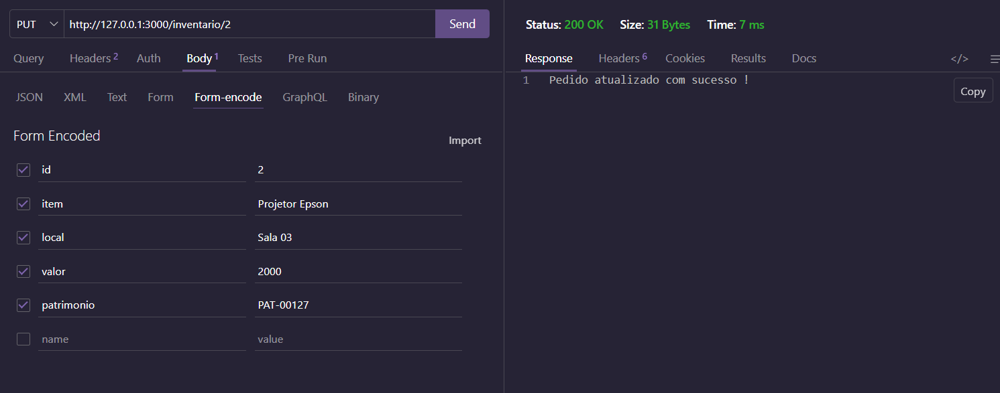
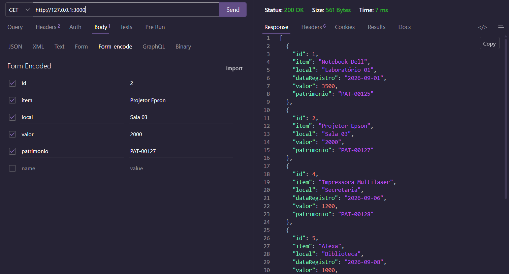

# Programa utilizando JavaScript, contendo a organização de itens de um inventário
- inventario.json
```JSON
[
  {
    "id": 1,
    "item": "Notebook Dell",
    "local": "Laboratório 01",
    "dataRegistro": "2026-09-01",
    "valor": 3500.00,
    "patrimonio": "PAT-00125"
  },
  {
    "id": 2,
    "item": "Projetor Epson",
    "local": "Sala 03",
    "dataRegistro": "2026-09-03",
    "valor": 2800.00,
    "patrimonio": "PAT-00126"
  },
  {
    "id": 3,
    "item": "Monitor LG",
    "local": "Laboratório 02",
    "dataRegistro": "2026-09-05",
    "valor": 850.00,
    "patrimonio": "PAT-00127"
  },
  {
    "id": 4,
    "item": "Impressora Multilaser",
    "local": "Secretaria",
    "dataRegistro": "2026-09-06",
    "valor": 1200.00,
    "patrimonio": "PAT-00128"
  },
  {
    "id": 5,
    "item": "Alexa",
    "local": "Biblioteca",
    "dataRegistro": "2026-09-08",
    "valor": 1000.00,
    "patrimonio": "PAT-00129"
  }
```

## Método para testar o projeto:
- 1 Clone o repositório
- 2 Abra com VsCode
- 3 Em um teminal CMD ou BASH, digite:
```
npm install
npm run dev
```
- 4 Teste as rotas com a extensão Thunder Client do VsCode

## Tecnologias:
- VsCode
- Node.js
- JavaScript
- JSON
- Thunder Client

## Rotas

| Método | Rota | Descrição |
| :--- | :--- | :--- |
| **GET** | `/` | Retorna a lista completa. |
| **GET** | `/inventario/:id` | Retorna um item específico pelo id. |
| **DELETE** | `/inventario/:id` | Remove o item referente ao id |
| **POST** | `/inventario/:id` | Cadastra um novo item informando o id. |
| **PUT** | `/inventario/:id` | Atualiza as informações do item pelo id. |

## Exemplos de requisição e testes com o Thunder Client
- Listar todos os itens:

- Buscar um item específico:

- Cadastrar um novo item usando Post e teste:


- Delete e teste:


- Put e teste (note que o valor foi alterado):


